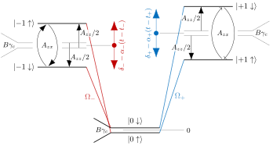

# Generalized Hamiltonian for multiple ¹³C atoms around an NV center

For the purpose of implementing a very general numerical model of the interaction of the nuclear spin of one or more ¹³C atoms with the electronic spin of a single NV center in diamond in a private `C13NV` Julia package, we extensively discuss the Hamiltonian and Liouvillian for the system in full generality. Within `C13NV`, the construction is encapsulated in a `make_nv_system` function, that receives various system parameters and returns a Hamiltonian or Liouvillian (a `QuantumPropagators.Generators.Generator` instance) along with a list of labels (each label is a tuple of strings).

We discuss first the high-level structure of the Hilbert space ([Structure of the Hilbert space](@ref sec-hilbert-structure)) and the Hamiltonian/Liouvillian ([Structure of the Hamiltonian and Liouvillian](@ref sec-hamiltonian-structure)) before deriving the operators in detail. [Lab Frame Hamiltonian for the Ground State Manifold](@ref sec-lab) lists the lab frame Hamiltonian and defines the spin operators for the electronic and nuclear spins. [Microwave Field Rotating Wave Approximation](@ref sec-rwa) transforms the lab frame Hamiltonian into the rotating frame. This yields one possible Hamiltonian to use numerically (`frame = :rwa`). [Diagonalizing the Hyperfine Interaction](@ref sec-diag) goes further by analytically diagonalizing the hyperfine interaction between the nuclear spin and the electronic spin of the NV center. This yields an alternative form of the Hamiltonian (`frame = :diag`), which allows for a better understanding of avoided Landau-Zener crossings, discussed in [Mapping between Electronic and Nuclear Spins via Landau-Zener Crossings](@ref sec-lz). Lastly, [Dissipators for the Excited and Metastable Manifolds](@ref sec-dissipation) describes the Lindblad operators for the full dissipative model.

## [Structure of the Hilbert space](@id sec-hilbert-structure)

- The optical Hilbert space is ``ℋ_O`` with levels ``|G⟩``, ``|E⟩``, ``|M⟩``. The Hilbert space may be truncated to ``|G⟩`` if the parameter `Λ` representing ``\Lambda(t)`` is passed as `nothing`. Note that `Λ = 0.0` is possible to force inclusion of all optical levels.
- The Hilbert space of the NV center electronic spin is ``ℋ_S`` with levels ``|+1⟩``, ``|0⟩``, ``|-1⟩``. The ``|-1⟩`` level is truncated if the `Ω₋` parameter representing ``\Omega_{-}(t)`` is given as `nothing`, and likewise for ``|+1⟩`` and `Ω₊`. Either `Ω₊` or `Ω₋` can be passed as `0.0` to force inclusion of the level.
- The nuclear spin of each surrounding C13 is a TLS with Hilbert space ``ℋ_I^{(n)}`` spanned by the states ``|↑⟩``, ``|↓⟩``. These get tensored into a ``2^N``-dimensional spin space ``ℋ_I = ℋ_I^{(1)} \otimes \dots \otimes ℋ_I^{(N)}``; for ``N=2``: ``|↑↑⟩``, ``|↑↓⟩``, ``|↓↑⟩``, ``|↓↓⟩``, etc., for larger ``N``.

The structure of the full Hilbert space is a little bit tricky, since the meta-stable state ``|M⟩`` does not distinguish between different electronic-spin degrees of freedom, and thus the three Hilbert spaces are not simply tensored. Instead,

```math
\begin{equation}\label{eq-Hilbert-space-structure}

\begin{split}
ℋ
&= ℐ_G \otimes ℋ_S \otimes ℋ_I\; \oplus \; ℐ_E \otimes ℋ_S \otimes ℋ_I\; \oplus \; ℐ_M \otimes ℋ_I\\
&= (ℐ_G \oplus ℐ_E) \otimes \, ℋ_S\, \otimes \, ℋ_I\; \oplus \; ℐ_M\, \otimes \, ℋ_I\\
&= \underbrace{((ℐ_G \oplus ℐ_E) \otimes \, ℋ_S\, \oplus \, ℐ_M)}_{\equiv ℋ_{OS}} \, \otimes \, ℋ_I\,,
\end{split}

\end{equation}
```

where ``ℐ_G``, ``ℐ_E``, and ``ℐ_M`` are the (trivial) one-dimensional Hilbert spaces consisting only of the optical levels ``|G⟩``, ``|E⟩``, and ``|M⟩``, respectively. ``ℋ_S`` is the Hilbert space of the electronic spin, spanned by the three levels ``|+1⟩``, ``|0⟩``, ``|-1⟩`` (or a truncation thereof). We may define ``ℋ_{OS} = ((ℐ_G \oplus ℐ_E) \otimes \, ℋ_S\, \oplus \, ℐ_M)`` in the third line of Equation ``\eqref{eq-Hilbert-space-structure}`` as the combined Hilbert space for the optical and electronic-spin degree of freedom, with the basis ``|G,+1⟩``, ``|G,0⟩``, ``|G,-1⟩``, ``|E,+1⟩``, ``|E,0⟩``, ``|E,-1⟩``, ``|M⟩``. The structure in lines 2 and 3 of Equation ``\eqref{eq-Hilbert-space-structure}`` is particularly helpful for constructing the relevant Lindblad operators in the full (optical) system.

## [Structure of the Hamiltonian and Liouvillian](@id sec-hamiltonian-structure)

The transitions in the electronic spin states of the NV center ``|+1⟩``, ``|0⟩``, ``|-1⟩ \in ℋ_S`` are driven by a microwave (MW) field

```math
\begin{equation}\label{eq-combined-mw-field}

\frac{1}{\sqrt{2}} \Omega(t) =
    \Omega_{-}(t) \cos(\omega_{-} t + \phi_{-}(t))
    + \Omega_{+}(t) \cos(\omega_{+} t + \phi_{+}(t))\,,

\end{equation}
```

where the factor ``\frac{1}{\sqrt{2}}`` is to compensate for the normalization factor in the ``\hat{S}_x`` operator, see below in [Lab Frame Hamiltonian for the Ground State Manifold](@ref sec-lab). In a two-color rotating frame for the central frequencies ``\omega_{\pm}``, this results in four independent control fields:

1.  ``\omega_{-}(t) \equiv \frac{d\phi_{-}(t)}{dt}``, the deviation (dynamic shift) from the central frequency ``\omega_{-}``. Note that we use both the time-dependent ``\omega_{-}(t)`` and the time-independent ``\omega_{-}`` with different meanings.
2.  ``\omega_{+}(t) \equiv \frac{d\phi_{+}(t)}{dt}``, the deviation (dynamic shift) from the central frequency ``\omega_{+}``
3.  ``\Omega_{-}(t)``, the envelope for the amplitude driving the ``|-1⟩ \leftrightarrow |0⟩`` transition
4.  ``\Omega_{+}(t)``, the envelope for the amplitude driving the ``|0⟩ \leftrightarrow |+1⟩`` transition

Within the `QuantumControl.jl` framework, the system Hamiltonian is expressed in the nested-list format

```math
\begin{equation}\label{eq-nested-list}

\hat{H} = [\hat{H_0}, [\hat{H}_{\omega_{-}}, \omega_{-}(t)], [\hat{H}_{\omega_{+}}, \omega_{+}(t)], [\hat{H}_{\Omega_{-}}, \Omega_{-}(t)], [\hat{H}_{\Omega_{+}}, \Omega_{+}(t)]]

\end{equation}
```

with the drift Hamiltonian ``\hat{H_0}``, the control Hamiltonians ``\hat{H}_{\omega_{-}}``, ``\hat{H}_{\omega_{+}}``, ``\hat{H}_{\Omega_{-}}``, and ``\hat{H}_{\Omega_{+}}``, and the controls listed above.

Construction of the Hamiltonian proceeds as follows:

1. Construct spin operators for the appropriately truncated Hilbert space ``ℋ_S``, as well as ``ℋ_I^{(n)}``
2. Construct the parts of Equation ``\eqref{eq-combined-mw-field}`` ``\in ℋ_S \otimes ℋ_I`` according to Equation ``\eqref{eq-rwa-hamiltonian-nested-list}`` if `frame = :rwa`, see [Microwave Field Rotating Wave Approximation](@ref sec-rwa), or Equation ``\eqref{eq-hamiltonian-diagonal-nested-list}`` if `frame = :diag`, see [Diagonalizing the Hyperfine Interaction](@ref sec-diag)
3. If the full optical Hilbert space ``ℋ_O`` is required (`Λ` is given), extend each operator into the full ``ℋ`` according to

   ```math
   \begin{equation}\label{eq-hamiltonian-extension}
   \hat{H}_{n} \rightarrow (𝟙_G \otimes \hat{H}_n) \,\oplus\, \underbrace{(𝟙_E \otimes 𝟘_S \otimes 𝟘_I) \,\oplus\, (𝟙_M \otimes 𝟘_I)}_{\text{padding}}
   \end{equation}
   ```

   cf. the first line of Equation ``\eqref{eq-Hilbert-space-structure}``, with the trivial ``𝟙_G =  𝟙_E  = 𝟙_M = 1``. That is, we are simply padding the Hamiltonian with zeros to reach the size of the full Hilbert space. The choice of ``𝟘_S`` and ``𝟘_I`` reflects the fact that there are no coherent dynamics in the ``|E⟩`` and ``|M⟩`` manifolds.

The `make_nv_system` function returns a Liouvillian if `Λ` is given, or if decay rates ``\gamma_{\pm 1}`` for the spontaneous decay in the electronic spin levels is given with a decay rate ``> 0``. The incoherent drive with `Λ` is time-dependent, and must be set up specially, see [Dissipators for the Excited and Metastable Manifolds](@ref sec-dissipation) for details.

## [Lab Frame Hamiltonian for the Ground State Manifold](@id sec-lab)

We are considering here the Hamiltonian of a single electronic spin described in the ground-state manifold ``|G⟩`` by the spin operators ``\hat{\mathbf{S}} = (\hat{S}_x, \hat{S}_y, \hat{S}_z)`` and ``N`` nuclear spins described by ``\hat{\mathbf{I}}^{(n)} = (\hat{I}^{(n)}_x, \hat{I}^{(n)}_y, \hat{I}^{(n)}_z)``, with the element ``A_{i,j}^{(n)}`` of the hyperfine tensor giving the strength of the interaction between the ``j = x,y,z`` components of the ``n``'th nuclear spin and the ``i = x,y,z`` component of the electronic spin. The full Hamiltonian has the form [AjoySA2018, MultiCarbon.jl](@cite),

```math
\begin{equation}\label{eq-lab-hamiltonian}

\hat{H}_{\text{lab}} = D \hat{S}_z^2 - \gamma_e \mathbf{B} \cdot \hat{\mathbf{S}} + \sum_{n=1}^{N} \left( \sum_{\substack{i,j\\=x, y, z}} A^{(n)}_{i,j} (\hat{S}_i \otimes \hat{I}^{(n)}_j) - \gamma_c \mathbf{B} \cdot \hat{\mathbf{I}}^{(n)}
\right) + \mu \Omega(t) \hat{S}_x\,,

\end{equation}
```

with ``\Omega(t)`` given by Equation ``\eqref{eq-combined-mw-field}``, the electronic spin energy ``D \approx`` 3 GHz, the electron gyromagnetic ratio ``\gamma_e =`` 2.8 MHz/G, the nuclear gyromagnetic ratio ``\gamma_c =`` 1.07 kHz/G, and the hyperfine tensor ``A^{(n)}`` mediating the interaction between the n-th carbon nuclear spin and the electronic spin of the NV center. The factor ``\mu`` is ``\mu = 1`` by default, but allows to account for the NV center seeing a reduced microwave field (due to field gradient across an ensemble of NV centers).The spin operators for the electronic spin are those for a spin-1 particle, with quantum numbers ``(+1, 0, -1)``, cf. the ``\hat{S}_z`` operator:

```math

\hat{S}_x = \frac{1}{\sqrt{2}}\begin{pmatrix}
    0 & 1 & 0 \\
    1 & 0 & 1 \\
    0 & 1 & 0
\end{pmatrix}\,,\quad
\hat{S}_y = \frac{1}{\sqrt{2}}\begin{pmatrix}
    0 & -i &  0 \\
    i &  0 & -i \\
    0 &  i &  0
\end{pmatrix}\,,\quad
\hat{S}_z = \begin{pmatrix}
    1 & 0 &   0 \\
    0 & 0 &   0 \\
    0 & 0 &  -1
\end{pmatrix}\,,\quad
𝟙_S = \begin{pmatrix}
    1 & 0 &  0 \\
    0 & 1 &  0 \\
    0 & 0 &  1
\end{pmatrix}\,.

```

If we are only going to drive one of the ``-1 \leftrightarrow 0`` or ``0 \leftrightarrow +1`` transitions, we can simply truncate the Hilbert space by cutting the above matrices from ``3 \times 3`` to ``2 \times 2``.

The nuclear spin is spin-``\frac{1}{2}``, and thus,

```math
\hat{I}_x^{(n)} = \frac{1}{2}\begin{pmatrix}
    0 & 1 \\
    1 & 0
\end{pmatrix}\,,\qquad
\hat{I}_y^{(n)} = \frac{1}{2}\begin{pmatrix}
    0 & -i \\
    i &  0
\end{pmatrix}\,,\qquad
\hat{I}_z^{(n)} = \frac{1}{2}\begin{pmatrix}
    1 &   0 \\
    0 &  -1
\end{pmatrix}\,,\qquad
𝟙_I^{(n)} = \begin{pmatrix}
    1 & 0 \\
    0 & 1
\end{pmatrix}\,,
```

with eigenstates labeled ``|↑⟩`` and ``|↓⟩``.

The magnetic field vector is

```math
\begin{equation}\label{eq-magnetic-field-vector}

\mathbf{B} = B \begin{pmatrix}
    \sin(\theta) \cos(\phi)\\
    \sin(\theta) \sin(\phi)\\
    \cos(\theta)
    \end{pmatrix}

\end{equation}
```

with the azimuthal angle ``\theta``, the polar angle ``\phi``, and the field-strength ``B``. We will assume ``\theta = 0``, but there is no need to restrict a numerical model to a magnetic field not aligned with the ``z``-axis defined by the NV center. In Equation ``\eqref{eq-lab-hamiltonian}``, operators are implicitly tensored with the identity operator of all other subspaces.

## [Microwave Field Rotating Wave Approximation](@id sec-rwa)

To simplify the numerical model, and to remove the fast oscillations ``\omega_{+}`` and ``\omega_{-}``, we transform the Hamiltonian to a rotating frame and apply the rotating wave approximation (RWA). The main result of this section is Equation ``\eqref{eq-rwa-hamiltonian}``.

The rotating frame is defined by the operator

```math
\begin{equation}\label{eq-U-RWA}

\hat{U}_{\text{RWA}}(t)
= \text{diag}\left[\;
\exp[i \omega_{+} t + \phi_{+}(t)], \quad
1, \quad
\exp[i \omega_{-} t + \phi_{-}(t)]
\;\right]

\end{equation}
```

in the electronic spin subspace. The wave function in the rotating frame is defined as ``|\tilde{\Psi}(t)⟩ = \hat{U}_{\text{RWA}}(t) |\Psi(t)⟩``. The Hamiltonian in the rotating frame is

```math
\begin{equation}\label{eq-H-RWA-general}

\hat{H}_{\text{RWA}} = i \hbar \dot{U}_{\text{RWA}} \hat{U}_{\text{RWA}}^\dagger + \hat{U}_{\text{RWA}} \hat{H}_{\text{lab}} \hat{U}_{\text{RWA}}^\dagger

\end{equation}
```

We again have the implicit tensor product, i.e., in the full Hilbert space, Equation ``\eqref{eq-H-RWA-general}`` is more properly written with ``\hat{U}_{\text{RWA}} \rightarrow \hat{U}_{\text{RWA}} \otimes 𝟙_I``. It is helpful to explicitly consider the transformation in the electronic-spin-subspace within this tensor structure. For the first term in Equation ``\eqref{eq-H-RWA-general}``,

```math
\begin{equation}\label{eq-RWA-term1}

i \hbar \left(\frac{\partial}{\partial t}(\hat{U}_{\text{RWA}} \otimes 𝟙_I)\right)\left(\hat{U}_{\text{RWA}} \otimes 𝟙_I \right)^\dagger
= (i \hbar \dot{U}_{\text{RWA}} \hat{U}_{\text{RWA}}^\dagger) \otimes 𝟙_I

\end{equation}
```

For the second term in Equation ``\eqref{eq-H-RWA-general}``, we observe that Equation ``\eqref{eq-lab-hamiltonian}`` has the form

```math
\begin{equation}\label{eq-H-as-sum-over-k}

\hat{H}_{\text{lab}} = \sum_k \hat{H}_S^{(k)} \otimes \hat{H}_I^{(k)}

\end{equation}
```

where ``k`` simply numbers the different terms, and ``\hat{H}_S^{(k)}`` and ``\hat{H}_I^{(k)}`` are operators in the electronic-spin and combined-nuclear-spins subspaces. Consequently,

```math
\begin{equation}\label{eq-RWA-term2}
\begin{split}
\left(\hat{U}_{\text{RWA}} \otimes 𝟙_I \right) \hat{H}_{\text{lab}} \left(\hat{U}_{\text{RWA}} \otimes 𝟙_I \right)^\dagger
&=
\sum_k \left(\hat{U}_{\text{RWA}} \otimes 𝟙_I \right) \left(\hat{H}_S^{(k)} \otimes \hat{H}_I^{(k)}\right)
\left(\hat{U}_{\text{RWA}} \otimes 𝟙_I \right)^\dagger \\
&= \sum_k \hat{U}_{\text{RWA}} \hat{H}_S^{(k)} \hat{U}_{\text{RWA}}^\dagger \otimes \hat{H}_I^{(k)}
\end{split}
\end{equation}
```

In both cases, we have made use of the distributive property of tensor and matrix products,

```math
\begin{equation}\label{eq-tensor-distributivity}

(\hat{A} \otimes \hat{B}) (\hat{C} \otimes \hat{D})
= \hat{A} \hat{C} \otimes \hat{B}\hat{D}

\end{equation}
```

We can now apply this to the individual operators in Equation ``\eqref{eq-lab-hamiltonian}``, while also neglecting any fast-rotating terms ``\propto \exp(\pm i \omega_{\pm}t)`` (or faster), with the resonance condition

```math
\begin{equation}\label{eq-resonance-condition}

\omega_{\pm} = D - B \gamma_e \cos(\theta) - \delta_{\pm}
\quad\Leftrightarrow\quad
\delta_{\pm} \equiv D - B \gamma_e \cos(\theta) - \omega_{\pm}\,,

\end{equation}
```

introducing the detunings ``\delta_{+}`` and ``\delta_{-}``.

One remarkable finding that simplifies the structure of the resulting rotating wave Hamiltonian is that [RWA_electronic_spin_system.jl](@cite)

```math
\begin{equation}\label{eq-S-in-RWA}

\hat{U}_{\text{RWA}} \hat{S}_{x,y} \hat{U}_{\text{RWA}}^\dagger
\approx 0\,,\qquad
\hat{U}_{\text{RWA}} \hat{S}_{z} \hat{U}_{\text{RWA}}^\dagger = \hat{S}_{z}\,,

\end{equation}
```

so that

```math
\begin{equation}\label{eq-hyperfine-RWA}

\hat{U}_{\text{RWA}} \left( \sum_{\substack{i,j\\=x, y, z}} A^{(n)}_{i,j} (\hat{S}_i \otimes \hat{I}^{(n)}_j) \right) \hat{U}_{\text{RWA}}^\dagger
= \sum_{\substack{j\\=x, y, z}} A_{z,j}^{(n)} \hat{S}_z \otimes \hat{I}_j^{(n)}
= \hat{S}_z \otimes \hat{A}_I^{(n)}\,,

\end{equation}
```

with the hyperfine projections

```math
\begin{equation}\label{eq-A-I-matrix}

\hat{A}_I^{(n)}
= \sum_j A_{z,j}^{(n)} \hat{I}_j^{(n)}
= \frac{1}{2} \begin{pmatrix}
          A_{zz}^{(n)} & A_{zx}^{(n)} - i A_{zy}^{(n)} \\
    A_{zx}^{(n)} + i A_{zy}^{(n)}  &      -A_{zz}^{(n)}
\end{pmatrix}\,.

\end{equation}
```

Similarly, we can define

```math
\begin{equation}\label{eq-B-I-matrix}

\hat{B}_I^{(n)}
= \mathbf{B} \cdot \hat{\mathbf{I}}^{(n)}
= \frac{B}{2} \begin{pmatrix}
\cos(\theta) & \sin(\theta)\cos(\phi) - i \sin(\theta)\sin(\phi)\\
\sin(\theta)\cos(\phi) + i \sin(\theta)\sin(\phi) & -\cos(\theta)
\end{pmatrix}\,.

\end{equation}
```

Going through all the terms in Equation ``\eqref{eq-lab-hamiltonian}``, we thus find

```math
\begin{equation}\label{eq-rwa-hamiltonian}

\hat{H}_{\text{RWA}}
= (\hat{\delta} - \hat{\omega}(t)) \otimes 𝟙_I + \sum_{n=1}^{N} \left(\hat{S}_z \otimes \hat{A}_I^{(n)} - \gamma_c 𝟙_S \otimes \hat{B}_I^{(n)} \right) + \hat{\Omega}(t) \otimes 𝟙_I\,,

\end{equation}
```

with

```math

\hat{\delta} = \text{diag}\left[\delta_{+}, 0, \delta_{-}\right],\quad
\hat{\omega}(t) = \text{diag}\left[\dot\phi_{+}(t), 0, \dot\phi_{-}(t)\right],\quad
\hat{\Omega}(t) = \frac{\mu}{2} \begin{pmatrix}
        0         &  \Omega_{+}(t)  &     0         \\
    \Omega_{+}(t) &      0          & \Omega_{-}(t) \\
        0         &  \Omega_{-}(t)  &      0
\end{pmatrix}\,.

```

For the nested-list format in Equation ``\eqref{eq-nested-list}``, this means

```math
\begin{equation}\label{eq-rwa-hamiltonian-nested-list}

\begin{split}
\hat{H}_{0, \text{RWA}} & = \hat{\delta} \otimes 𝟙_I + \sum_{n=1}^{N} \left(\hat{S}_z \otimes \hat{A}_I^{(n)} - \gamma_c 𝟙_S \otimes \hat{B}_I^{(n)} \right) \\
\hat{H}_{\omega_{-}, \text{RWA}} & = -|-1⟩⟨-1| \; \otimes \; 𝟙_I \\
\hat{H}_{\omega_{+}, \text{RWA}} & = -|+1⟩⟨+1| \; \otimes \; 𝟙_I \\
\hat{H}_{\Omega_{-}, \text{RWA}} & = \frac{\mu}{2} \left( |0⟩⟨-1| + |-1⟩⟨0| \right) \otimes 𝟙_I \\
\hat{H}_{\Omega_{+}, \text{RWA}} & = \frac{\mu}{2} \left( |0⟩⟨+1| + |+1⟩⟨0| \right) \otimes 𝟙_I
\end{split}

\end{equation}
```

These operators are all in ``ℋ_S \otimes ℋ_I``.

### Linear Chirp and Single Carbon



The energy levels are depicted in the figure above, for the special case of a linear chirp,

```math
\begin{equation}\label{eq-linear-chirp}

\dot\phi_{\pm}(t) = \alpha_{\pm} (t - t_{\pm})\,,

\end{equation}
```

a single carbon atom in the z-x plane (``A_{zy} = 0``) and the ``B`` field aligned to the ``z`` axis (``\theta = \phi = 0`` in Equation ``\eqref{eq-magnetic-field-vector}``).

In explicit matrix form, the Hamiltonian for this special case in the subspace including the electronic spin ``0`` and the ``+1`` subspace is [AjoySA2018_Hamiltonian.jl](@cite)

```math
\begin{equation}\label{eq-hamiltonian-rwa-matrix-plus}

\hat{H}_{\text{RWA}, +} = \begin{pmatrix}
    \frac{A_{zz}}{2} - \frac{B \gamma_c}{2} - \alpha_{+}(t - t_{+}) + \delta_{+} & \frac{A_{zx}}{2} & \frac{\mu\Omega_{+}(t)}{2} & 0 \\
    \frac{A_{zx}}{2} & -\frac{A_{zz}}{2} + \frac{B \gamma_c}{2} - \alpha_{+} (t - t_{+}) + \delta_{+} & 0 & \frac{\mu\Omega_{+}(t)}{2} \\
    \frac{\mu\Omega_{+}(t)}{2} & 0 & -\frac{B \gamma_c}{2} & 0 \\
    0 & \frac{\mu\Omega_{+}(t)}{2} & 0 & \frac{B \gamma_c}{2}
\end{pmatrix}\,,

\end{equation}
```

and, in the subspace with electronic spin ``0`` and ``-1``,

```math
\begin{equation}\label{eq-hamiltonian-rwa-matrix-minus}

\hat{H}_{\text{RWA}, -} = \begin{pmatrix}
    -\frac{B \gamma_c}{2} & 0 & \frac{\mu\Omega_{-}(t)}{2} & 0\\
    0 & \frac{B \gamma_c}{2} & 0 & \frac{\mu\Omega_{-}(t)}{2} \\
    \frac{\mu\Omega_{-}(t)}{2} & 0 & - \frac{A_{zz}}{2} - \frac{B \gamma_c}{2} - \alpha_{-}(t - t_{-}) + \delta_{-} & \frac{A_{zx}}{2} \\
    0 & \frac{\mu\Omega_{-}(t)}{2} & -\frac{A_{zx}}{2} & \frac{A_{zz}}{2} + \frac{B \gamma_c}{2} - \alpha_{-} (t - t_{-}) + \delta_{-} \\
\end{pmatrix}\,.

\end{equation}
```

Note the off-resonant Rabi-cycling in the ``|\pm 1⟩`` manifolds, cf. also Equation ``\eqref{eq-A-I-matrix}``.

## [Diagonalizing the Hyperfine Interaction](@id sec-diag)

We can further simplify the Hamiltonian by diagonalizing the projection of the hyperfine matrix into the nuclear-spin subspace, Equation ``\eqref{eq-A-I-matrix}``. We note that ``\hat{A}_I^{(n)}`` is Hermitian, and thus real-valued eigenvalues and a unitary transformation operator ``\hat{R}^{(n)}`` so that

```math
\begin{equation}\label{eq-eigendecomposition}

\hat{A}_I^{(n)}
= \hat{R}^{(n)}
    \begin{pmatrix}
    \lambda_{+} & 0 \\ 0 & \lambda_{-}
  \end{pmatrix}
  \hat{R}^{(n)\dagger}

\end{equation}
```

This eigendecomposition can be solved analytically [DiagonalizeHyperfine.jl](@cite) with

```math
\begin{equation}\label{eq-analytical-eigenvalues}

\lambda_{\pm} = \frac{\operatorname{tr}(\hat{A}_I^{(n)})}{2} \pm \sqrt{\frac{\operatorname{tr}^2(\hat{A}_I^{(n)})}{4} - \det(\hat{A}_I^{(n)})}

\end{equation}
```

We can see that

```math

\operatorname{tr}(\hat{A}_I^{(n)}) = 0, \qquad
\det(\hat{A}_I^{(n)}) = -\frac{1}{4} {A^{(n)}}^2\,,

```

with the overall hyperfine magnitude

```math
\begin{equation}\label{eq-A}

A^{(n)} \equiv \sqrt{{A_{zz}^{(n)}}^2 + {A_{zx}^{(n)}}^2 + {A_{zy}^{(n)}}^2}\,.

\end{equation}
```

Thus, we have

```math
\begin{equation}\label{eq-lambda}

\lambda_{\pm} = \pm A / 2

\end{equation}
```

and

```math
\begin{equation}\label{eq-eigendecomposition-A}

\hat{A}_I^{(n)} = A \, \hat{R}^{(n)} \hat{I}_z^{(n)} \hat{R}^{(n)\dagger}

\end{equation}
```

For ``R^{(n)}``, with proper normalization (``R^{(n)} {R^{(n)}}^{\dagger} = 𝟙_I^{(n)}``), we find (temporarily dropping the superscript ``(n)`` on the right-hand-side):

```math
\begin{equation}\label{eq-R}

\hat{R}^{(n)} = \frac{1}{\sqrt{2}} \begin{pmatrix}
    \frac{A_{zz} + A}{\sqrt{A^2 + A A_{zz}}} & \frac{A_{zz} - A}{\sqrt{A^2 - A A_{zz}}} \\
    \frac{A_{zx} + i A_{zy}}{\sqrt{A^2 + A A_{zz}}} & \frac{A_{zx} + i A_{zy}}{\sqrt{A^2 - A A_{zz}}}
\end{pmatrix}

\end{equation}
```

For the total Hamiltonian, we can now define a diagonal frame via the unitary

```math
\begin{equation}\label{eq-R-total}

\hat{R} = \hat{R}^{(1)} \otimes \dots \otimes \hat{R}^{(N)}\,.

\end{equation}
```

The Hamiltonian in this diagonal frame is

```math
\begin{equation}\label{eq-hamiltonian-diagonal}

\begin{split}
\hat{H}_{\text{diag}}
& = \hat{R}^\dagger \hat{H}_{\text{RWA}} \hat{R} \\
& = (\hat{\delta} - \hat{\omega}(t)) \otimes 𝟙_I + \sum_{n=1}^{N} \left(A^{(n)} \hat{S}_z \otimes \hat{I}_z^{(n)} - \gamma_c 𝟙_S \otimes \hat{B}_I^{(n)} \right) + \hat{\Omega}(t) \otimes 𝟙_I\,,
\end{split}

\end{equation}
```

with ``\hat{B}_I^{(n)}`` defined in Equation ``\eqref{eq-B-I-matrix}``. Any wave function ``|\tilde{\Psi}(t)⟩`` in the rotating frame is transformed into the diagonal frame as ``|\Psi(t)⟩ = \hat{R}^\dagger |\tilde{\Psi}(t)⟩``. Note the dagger, as we have used the common notation for the eigendecomposition in Equation ``\eqref{eq-eigendecomposition}``, which is the opposite from the notation used for the rotating frame, cf. Equation ``\eqref{eq-H-RWA-general}``. The transformation affects the relative population in the nuclear spins. In the diagonal frame, after ``\Omega(t)`` has been switched off, the populations remain stable (since the Hamiltonian is diagonal). In contrast, in the lab/rotating frame, we would be seeing indefinite off-resonant Rabi-cycling in the ``|\pm 1⟩`` manifolds. The transformation ``\hat{R}`` precisely restores the superposition due to this Rabi cycling.

For the nested-list format in Equation ``\eqref{eq-nested-list}``, this means

```math
\begin{equation}\label{eq-hamiltonian-diagonal-nested-list}

\hat{H}_{0, \text{diag}} =  \hat{\delta} \otimes 𝟙_I + \sum_{n=1}^{N} \left(A^{(n)} \hat{S}_z \otimes \hat{I}_z^{(n)} - \gamma_c 𝟙_S \otimes \hat{B}_I^{(n)} \right)

\end{equation}
```

and ``\hat{H}_{\omega_{-}, \text{diag}}`` ``\hat{H}_{\omega_{+}, \text{diag}}`` ``\hat{H}_{\Omega_{-}, \text{diag}}`` ``\hat{H}_{\Omega_{+}, \text{diag}}`` as in Equation ``\eqref{eq-rwa-hamiltonian-nested-list}``; all operators in ``ℋ_S \otimes ℋ_I``. The only difference between the rotating frame Hamiltonian in Equation ``\eqref{eq-rwa-hamiltonian}`` and the diagonal frame Hamiltonian is the term ``\hat{S}_z \otimes \hat{A}_I^{(n)}`` in Equation ``\eqref{eq-rwa-hamiltonian}`` and Equation ``\eqref{eq-rwa-hamiltonian-nested-list}`` being replaced with ``A^{(n)} \hat{S}_z \otimes \hat{I}_z^{(n)}`` in Equation ``\eqref{eq-hamiltonian-diagonal}`` and Equation ``\eqref{eq-hamiltonian-diagonal-nested-list}``.

### Linear Chirp and Single Carbon

As we did in the rotating frame in Equation ``\eqref{eq-hamiltonian-rwa-matrix-plus}`` and Equation ``\eqref{eq-hamiltonian-rwa-matrix-minus}``, we can again write out the Hamiltonian for the ``0/+1`` and ``0/-1`` manifolds under the assumption of a single nuclear spin and a linear chirp.

```math
\begin{equation}\label{eq-hamiltonian-diag-matrix-plus}

\hat{H}_{\text{RWA}, +} = \begin{pmatrix}
    \frac{A}{2} - \frac{B \gamma_c}{2} - \alpha_{+}(t - t_{+}) + \delta_{+} &         0        & \frac{\mu\Omega_{+}(t)}{2} & 0 \\
            0        & -\frac{A}{2} + \frac{B \gamma_c}{2} - \alpha_{+} (t - t_{+}) + \delta_{+} & 0 & \frac{\mu\Omega_{+}(t)}{2} \\
    \frac{\mu\Omega_{+}(t)}{2} & 0 & -\frac{B \gamma_c}{2} & 0 \\
    0 & \frac{\mu\Omega_{+}(t)}{2} & 0 & \frac{B \gamma_c}{2}
\end{pmatrix}\,,

\end{equation}
```

```math
\begin{equation}\label{eq-hamiltonian-diag-matrix-minus}

\hat{H}_{\text{RWA}, -} = \begin{pmatrix}
    -\frac{B \gamma_c}{2} & 0 & \frac{\mu\Omega_{-}(t)}{2} & 0\\
    0 & \frac{B \gamma_c}{2} & 0 & \frac{\mu\Omega_{-}(t)}{2} \\
    \frac{\mu\Omega_{-}(t)}{2} & 0 & - \frac{A}{2} - \frac{B \gamma_c}{2} - \alpha_{-}(t - t_{-}) + \delta_{-} &        0         \\
    0 & \frac{\mu\Omega_{-}(t)}{2} &         0         & \frac{A}{2} + \frac{B \gamma_c}{2} - \alpha_{-} (t - t_{-}) + \delta_{-} \\
\end{pmatrix}\,,

\end{equation}
```

with the ``A`` given in Equation ``\eqref{eq-A}``.

## [Mapping between Electronic and Nuclear Spins via Landau-Zener Crossings](@id sec-lz)

TODO

After a Landau-Zener transition, the probability of population transfer is [LandauZener.jl](@cite)

```math
\begin{equation}\label{eq-lz-probability}

P_{LZ} = \exp\left(-2 \pi \frac{\vert\Omega\vert^2}{\vert\alpha\vert} \right)

\end{equation}
```

## [Dissipators for the Excited and Metastable Manifolds](@id sec-dissipation)


The optical laser field ``\Lambda(t)`` enables incoherent transitions between the ground state ``|G⟩`` manifold described above, and the excited state manifold ``|E⟩``. We also have a decay channel from ``|E⟩`` to ``|G⟩`` via the metastable state ``|M⟩`` (frequently also indicated as ``|S⟩`` in the literature, but this might cause confusion), as depicted in the level scheme figure above.

The dynamics are described by a master equation in Lindblad form with the following Lindblad operators:

- ``\hat{A}_{\Lambda} = \sqrt{\Lambda(t)} |E⟩⟨G| \otimes 𝟙_S \otimes 𝟙_I \, \oplus\, 𝟘_M \otimes 𝟙_I``
- ``\hat{A}_{\Gamma} = \sqrt{\Gamma}|G⟩⟨E| \otimes 𝟙_S \otimes 𝟙_I \, \oplus\, 𝟘_M \otimes 𝟙_I``

where ``|E⟩⟨G|`` and ``|G⟩⟨E|`` are operators in the two-dimensional Hilbert space ``ℐ_G \oplus ℐ_E``, cf. the second line in Equation ``\eqref{eq-Hilbert-space-structure}``. The first of the two Lindblad operators above describes the somewhat unusual _incoherent_ excitation of the ``|E⟩`` manifold. The time-dependent ``\Lambda(t)`` is not directly supported by the `QuantumControl.liouvillian` function. Instead, we construct a super-operator [Goerz1312.0111v2](@cite)

```math
\begin{equation}\label{eq-dissipation-superop}

L = (\hat{A}^\dagger)^T \otimes \hat{A} - \frac{1}{2} \left(𝟙 \otimes \hat{A}^\dagger \hat{A}\right) - \frac{1}{2} \left((\hat{A}^\dagger \hat{A})^T \otimes 𝟙\right)\,,

\end{equation}
```

with ``\hat{A}`` the operator ``\hat{A}_{\Lambda}`` for ``\sqrt{\Lambda(t)} = 1`` (i.e., without the rate factor). This is done by calling the `QuantumControl.liouvillian` function with `nothing` as the Hamiltonian and ``\hat{A}`` as the only element in `c_ops`. The resulting ``L`` is then added with a drive ``\Lambda(t)`` to the Liouvillian super-operator initialized automatically via the `QuantumControl.liouvillian` function from the coherent Hamiltonian previously constructed, the dissipator ``\hat{A}_{\Gamma}``, and the following further dissipators:

- ``\hat{A}_{\Gamma_{0}} = \sqrt{\Gamma_{0}}|M⟩⟨E,0| \otimes 𝟙_I``

- ``\hat{A}_{\Gamma_{-1}} = \sqrt{\Gamma_{-1}}|M⟩⟨E,-1| \otimes 𝟙_I``

- ``\hat{A}_{\Gamma_{+1}} = \sqrt{\Gamma_{+1}}|M⟩⟨E,+1| \otimes 𝟙_I``

- ``\hat{A}_{\Sigma_{0}} = \sqrt{\Sigma_{0}}|G,0⟩⟨M| \otimes 𝟙_I``

- ``\hat{A}_{\Sigma_{-1}} = \sqrt{\Sigma_{-1}}|G,-1⟩⟨M| \otimes 𝟙_I``

- ``\hat{A}_{\Sigma_{+1}} = \sqrt{\Sigma_{+1}}|G,+1⟩⟨M| \otimes 𝟙_I``

- ``\hat{A}_{\gamma_{+1}} = \sqrt{\gamma_{+1}}|G,0⟩⟨G,+1| \otimes 𝟙_I``

- ``\hat{A}_{\gamma_{-1}} = \sqrt{\gamma_{-1}}|G,0⟩⟨G,-1| \otimes 𝟙_I``

The last two operators are under the assumption that spontaneous decay of the electronic spin occurs only in the ``|G⟩`` manifold, as indicated in the figure above; if that decay also occurred in the ``|E⟩`` manifold, the corresponding terms ``|E,0⟩⟨E,\pm 1|`` would have to be added to ``\hat{A}_{\gamma_{\pm1}}``. All of the above decay operators follow the structure of the third line in Equation ``\eqref{eq-Hilbert-space-structure}``.
